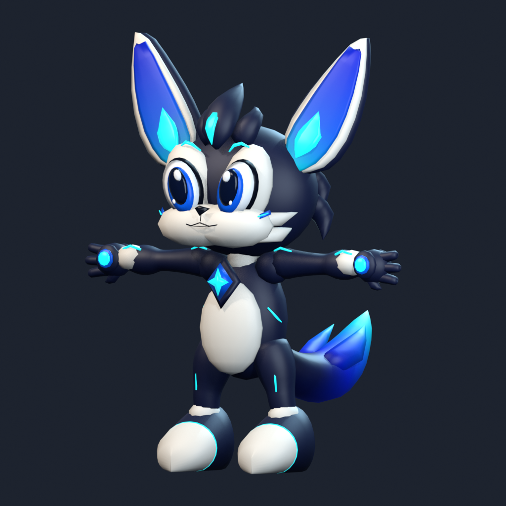

# Navi v1 — Blender build report

Built offline in Blender **5.2.2 LTS**, using the supplied front, side and back concepts. The model preserves the navy/cream fox silhouette, tall illuminated ears, cyan hair streak, glossy eyes, cheek tufts, chest star, wrist lights, back ring/seam, cream boot toes and swept blue-to-cyan tail. It is a simplified game model rather than a pixel-exact reproduction of the concept sculpture.



## Deliverables

- [Runtime GLB](../assets/models/navi-v1.glb): **774,428 bytes**, one skinned mesh, one armature, embedded texture, three morph targets and six separate animations. glTF +Y up.
- [Working Blender file](../assets/models/navi-v1.blend): editable quad geometry, materials, shape keys, named actions and studio setup. Opens in the neutral T-pose; animation tracks are muted deliberately. Select an action on `NaviRig` to preview it, with its matching `*_Face` action on the mesh's shape-key datablock.
- [Build script](../tools/blender/build_navi.py), [validation script](../tools/blender/validate_navi.py), and [pose renderer](../tools/blender/render_navi_pose.py).
- [Machine-readable final QA](../tools/blender/qa/final-validation.json), plus per-iteration counts in `tools/blender/qa/iteration-1.json` through `iteration-5.json` and build logs.

## Geometry and shading

| Property | Result |
|---|---:|
| Exported triangles | **14,872** |
| Blender vertices | 7,650 |
| Blender faces | 6,834 |
| Quad faces | 6,520 (**95.4%**) |
| Character mesh objects | 1 |
| Bones | 27 |
| Height | **1.000000 m** |
| Feet | Z = 0 |
| Facing | Blender −Y |
| Nonmanifold edges / loose vertices / zero-area faces | **0 / 0 / 0** |

Geometry was bisected at X=0, mirrored with a Mirror modifier, and the modifier applied before skinning. The validation found no unpaired mirrored positions. The mesh contains closed, overlapping anatomical/detail shells; it is not a single welded skin surface. Arms are horizontal in the rest pose, fingers spread, and feet separated.

The tail has **9.89 mm minimum rest clearance** from torso/legs and zero surface intersections. Ears attach around the head, with **202.10 mm clearance from torso/legs**. The tail and ear shells retain independent deformation regions.

All eight materials use **Principled BSDF**. Required materials: `Navi_Navy` (#10183A), `Navi_Cream` (#F1E9DC), `Navi_Glow` (#18E0E8, emission strength 1), `Navi_Eye`, `Navi_EyeHighlight`, and `Navi_Nose`. Two auxiliary materials are `Navi_AccentBlue` and `Navi_TailGradient`. One generated **32×128** gradient image is packed into the blend and embedded in the GLB; there are no external texture dependencies. The cyan seams, star, wrist lenses and inner-ear accents carry real emission. Bloom is left to the application.

## Rig and weights

Armature: **`NaviRig`**. Complete bone list:

```text
Hips
Spine
Chest
Neck
Head
Shoulder.L    Shoulder.R
UpperArm.L    UpperArm.R
LowerArm.L    LowerArm.R
Hand.L        Hand.R
UpperLeg.L    UpperLeg.R
LowerLeg.L    LowerLeg.R
Foot.L        Foot.R
Tail.1 → Tail.2 → Tail.3 → Tail.4
Ear.L.1 → Ear.L.2
Ear.R.1 → Ear.R.2
```

The humanoid chains descend from the hips/chest, the tail chain is parented to `Hips`, and ear chains to `Head`.

Blender's automatic heat-weight parenting was run first. It emitted a heat-solver warning and left the layered mesh unweighted. This was detected and repaired with deterministic anatomical weights, smoothly interpolated across the elbows, wrists, knees, torso and appendage chains. The final result does **not** rely on the failed heat solution.

Printed weight report after repair:

- **0** unweighted vertices; **0** non-normalized weight sums.
- Maximum **2** bone influences per vertex.
- All **264 tail vertices** weighted only to `Tail.1`–`Tail.4`; **0** leg or other foreign weights.
- All **744 ear vertices** weighted only to the corresponding ear chain; **0** foreign or opposite-side weights.
- Independent tail test: rotating only `Tail.1` moved tail vertices up to **130.84 mm** while maximum leg movement was **0.000000 m**.

## Face and animations

Exact shape-key names: **`Blink`**, **`Happy`**, **`MouthOpen`**. Blink retracts the eye surfaces beneath the cream mask and exposes curved dark lid lines. Happy squints the eyes and raises the smile corners. MouthOpen opens the dark mouth shape. Each control has a separate verification render.

All clips are authored and exported at **30 fps**. Skeletal and facial NLA tracks are merged by clip name in the GLB; it contains exactly these six animations:

| Action | Frames | Duration | Behavior |
|---|---:|---:|---|
| `Idle` | 0–120 | 4 s | Breathing, ear/tail sway and blink; loop |
| `Wave` | 0–90 | 3 s | Right arm lifts; wrist waves; small smile |
| `HappyJump` | 0–60 | 2 s | Anticipation, upward motion, lifted arms and landing |
| `TailWag` | 0–60 | 2 s | Four-bone tail sway; loop |
| `Listen` | 0–90 | 3 s | Head tilt and ear movement |
| `Sleep` | 0–120 | 4 s | Slumped torso/head, closed eyes, curled tail and breathing; loop |

Loop endpoints match numerically: maximum exported channel difference is below **6×10⁻¹⁷**. Loop playback mode is set by the consuming application; loop metadata is also stored on the Blender actions.

## Visual QA and iteration record

The three concept images were inspected before modeling and reopened during each turnaround comparison. Each pass rendered front, side, back and three-quarter views in Eevee against a dark studio background.

| Pass | Triangles | Review and changes |
|---|---:|---|
| 1 | 27,100 | Established the character. Found narrow ears, visible shoulder gaps, angular sweeps, a tail pinch and excessive density. |
| 2 | 18,468 | Broadened head/ears, filled shoulder joins, rebuilt boots, smoothed swept geometry and fixed the tail's changing cross-section orientation. |
| 3 | 15,864 | Lowered ear roots, widened eyes/palms, strengthened inner-ear cyan, improved the tuft and moved the back seam onto the visible surface. |
| 4 | 15,416 | Angled the eye masks, enlarged the nose, lifted the smile, refined saturation and increased tail clearance. Checked wave, wag and sleep deformation. |
| 5 | **14,872** | Reduced eye depth rings, repaired the closed-eye appearance, softened studio illumination and verified all face controls. |

Earlier turnarounds are retained as `renders/navi-v1-iter1-*.png` through `navi-v1-iter4-*.png`. Final turnarounds are `navi-v1-front.png`, `navi-v1-side.png`, `navi-v1-back.png` and `navi-v1-threequarter.png`.

Animation evidence includes [Wave, frame 45](../renders/navi-v1-wave.png) and [TailWag, frame 35](../renders/navi-v1-tailwag.png), showing intact arm deformation and independent tail movement. Additional renders cover Idle, HappyJump, Listen and Sleep, and the three individual face controls. The jump preview uses camera framing fitted to its airborne pose.

Binary GLB checks verify skin attributes, all animation names, all morph names, real emission, triangle count and loop endpoints. Re-importing the GLB into a fresh Blender scene succeeds; the imported character measures **0.999999991 m**. Import-created bone display helper geometry is excluded from character measurements.

## Known limitations and next improvements

- Fur, ear rims, boots and cheek contours are simpler and more faceted than the concept sculpture, particularly in close-up. Further sculpting and redistribution of the existing triangle budget would improve the match.
- The face uses layered surfaces and stylized morphs, not a continuous facial muscle rig. MouthOpen has a simple dark cavity; fingers share their hand bone.
- The rig is an FK game skeleton without IK controls. Supplied poses are checked, but arbitrary extreme user poses may reveal intersections between overlapping shells.
- Sleep is a standing slump with a curled tail, rather than a fully seated or lying curl.
- Export and import were validated locally. Application-specific lighting, bloom, animation blending and mobile performance have not been profiled.

## Reproduce

Run from `C:\CloudeRepo\NAVI` in PowerShell. No network, packages or downloads are required.

```powershell
& 'C:\Program Files\Blender Foundation\Blender 5.2\blender.exe' --background --python tools/blender/build_navi.py -- --iteration 5 --final --resolution 1024
& 'C:\Program Files\Blender Foundation\Blender 5.2\blender.exe' --background --python tools/blender/validate_navi.py
& 'C:\Program Files\Blender Foundation\Blender 5.2\blender.exe' --background --python tools/blender/render_navi_pose.py -- HappyJump Idle
```

To inspect earlier design passes, run the build with `--iteration 1`, `2`, `3` or `4` and omit `--final`. These write a review blend and iteration-prefixed turnarounds while preserving the final deliverables.
