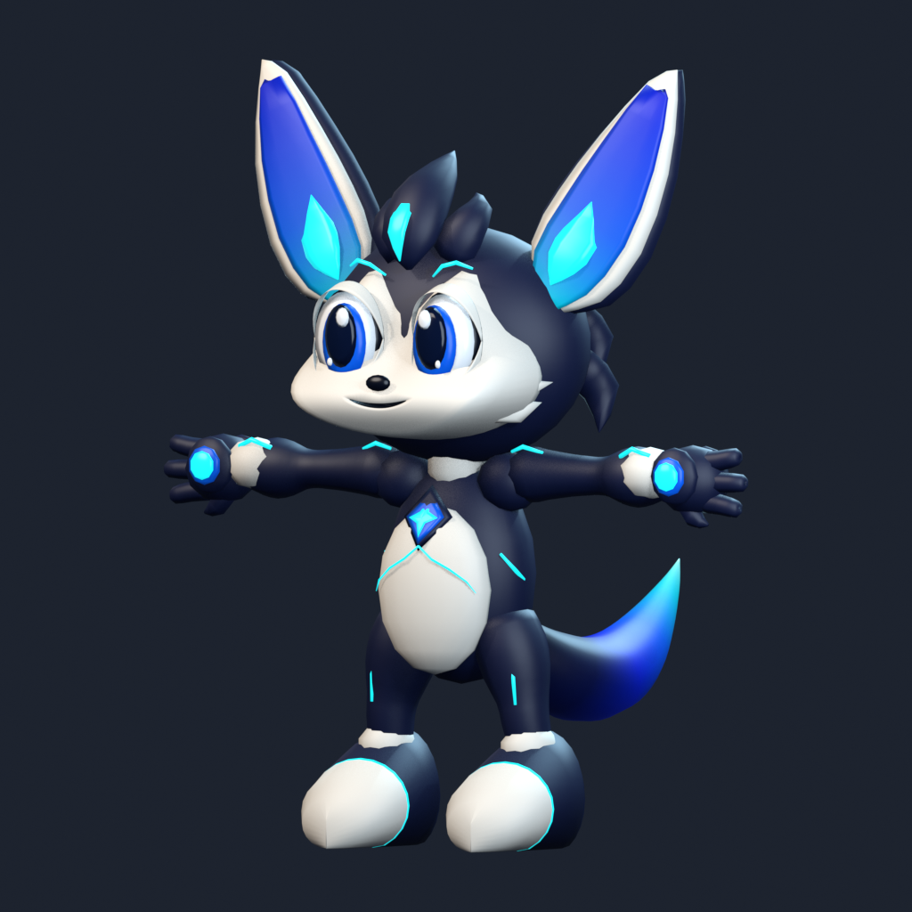

# Navi v2 — softer face and idle life

Built offline in Blender **5.2.2 LTS**, starting from the v1 builder and all three supplied concepts. The original v1 source, model files, report and renders remain unchanged. No packages were installed and no network services were used.



## Deliverables

- [Runtime GLB](../assets/models/navi-v2.glb): one skinned mesh, the original armature contract, **11 separate animations**, and **five morph targets**.
- [Editable Blender file](../assets/models/navi-v2.blend): geometry, materials, rig, shape keys, actions and studio. Opens in the neutral T-pose. NLA tracks are muted for editing; assign an action to `NaviRig` and its matching `*_Face` action to the mesh shape-key datablock to preview it.
- [Standalone builder](../tools/blender/build_navi_v2.py), [validator](../tools/blender/validate_navi_v2.py), and [pose renderer](../tools/blender/render_navi_v2_pose.py).
- [Final machine-readable QA](../tools/blender/qa/v2-final-validation.json) and [validation log](../tools/blender/qa/v2-final-validation.log).
- [Action and expression contact sheet](../renders/navi-v2-actions-contact.png).

## Changes against v1

| Feature | v1 | v2 |
|---|---|---|
| Face skin | Separate eye masks and overlapping cheek balls | One continuous cream surface from eye surrounds through both cheeks and muzzle |
| Mouth | Dark curve and flattened mouth shell | An opening in the face topology, with lip thickness, recessed cavity walls and a closed interior |
| Blink | Eye geometry retracts and flattens | Solid upper/lower eyelids move over fixed eyes; measured eye displacement **0.000000 m** |
| Eye projected area, one eye | 0.01191046 m² | 0.01071941 m²: **10.00% smaller** |
| Hand dimensions, X/Y/Z | 123.011 / 104.092 / 94.796 mm | 137.772 / 116.583 / 106.171 mm: **12.00% larger on every axis** |
| Distal forearm radius | Original profile | **12% larger**, easing into the unchanged elbow; full distal cross-section increases **25.44%** |
| Head | Original navy skull | Original skull geometry and dimensions retained; facial skin rebuilt within that silhouette |
| Chest core | Raised, long diamond badge | Smaller, shallow diamond panel following the torso surface, with a cyan line continuing into the belly |
| Tail root radii, authored space | 13 / 12 mm | 16 / 15 mm: **+23.1% / +25.0%** |
| Tail upper-brush radius | 43 / 44 mm | 30 / 32 mm, producing a stronger taper |
| Tail surface | Main sweep plus two overlapping tips | One continuous sweep with **33 longitudinal rings** and smooth cubic B-spline skin-weight blending |
| Sleep silhouette | Standing slump | Seated curl, lowered head, limp ears, hands in lap, tail wrapped close; measured height **0.662–0.664 m** |
| Triangles | 14,872 | **17,736**, within the requested 10k–18k budget |
| Shape keys / animations | 3 / 6 | **5 / 11** |

The chest frame's authored outline is **78 × 87 mm**, versus **98 × 126 mm** in v1. Its cream/navy contact follows the actual torso and belly surfaces. The added light line is the requested connection from the core into the body; no armor plates or additional tech ornaments were added. The original eight material names are retained, including emissive `Navi_Glow`.

## Rig, topology and weights

Armature: **`NaviRig`**. All **27 bone names**, hierarchy and bind positions are preserved. The measured maximum head/tail bind-position difference from v1 is **0 m**.

```text
Hips
Spine
Chest
Neck
Head
Shoulder.L    Shoulder.R
UpperArm.L    UpperArm.R
LowerArm.L    LowerArm.R
Hand.L        Hand.R
UpperLeg.L    UpperLeg.R
LowerLeg.L    LowerLeg.R
Foot.L        Foot.R
Tail.1 → Tail.2 → Tail.3 → Tail.4
Ear.L.1 → Ear.L.2
Ear.R.1 → Ear.R.2
```

| Check | Result |
|---|---:|
| Rest height / minimum Z | **1.000000 m / 0 m** |
| Forward direction | Blender **−Y**; exported glTF uses +Y up |
| Vertices / faces | **9,070 / 8,262** |
| Quad faces | **8,036**, 97.3% |
| Character meshes / material slots | **1 / 8** |
| Nonmanifold edges / loose vertices / zero-area faces | **0 / 0 / 0** |
| Unweighted vertices / non-normalized weights | **0 / 0** |
| Maximum bone influences | **4** |
| Tail vertices / foreign tail weights | **528 / 0** |
| Ear vertices / foreign or opposite-side ear weights | **744 / 0** |
| Unpaired mirrored positions | **0** |
| Tail–body intersections in rest pose | **0** |
| Minimum tail–body rest clearance | **8.697 mm** |
| Minimum ear–torso/leg rest clearance | **202.103 mm** |

The v1 deterministic anatomical weighting approach is retained directly. The failed v1 heat-weight solve is not repeated. Tail vertices carry only `Tail.1`–`Tail.4`; ear vertices carry only their corresponding ear chain, satisfying the allowed ear-chain-plus-Head rule. Rotating only `Tail.1` moves the tail by up to **126.14 mm** while maximum leg movement remains **0 m**.

## Actions and shape keys

All clips are authored at **30 fps**. Skeletal and facial NLA tracks are merged by clip name into the exported animations. Durations were read back from the GLB accessors.

| Action | Frames | Seconds | Playback and behavior |
|---|---:|---:|---|
| `Idle` | 0–120 | 4 | Loop; breathing, ear/tail sway and a lid blink |
| `Wave` | 0–90 | 3 | One-shot; right hand greeting and smile |
| `HappyJump` | 0–60 | 2 | One-shot; anticipation, jump and landing |
| `TailWag` | 0–60 | 2 | Loop; phased movement along all four tail bones |
| `Listen` | 0–90 | 3 | One-shot; head tilt and ear response |
| `Sleep` | 0–120 | 4 | Loop; seated curl, wrapped tail, closed lids and slow breathing |
| `Notice` | 0–60 | 2 | One-shot; turns from an averted head pose toward the Operator, perks ears and takes a small forward step |
| `Stretch` | 0–90 | 3 | One-shot; arms overhead, chest opens, head lifts and tail rises |
| `Inspect` | 0–120 | 4 | Loop; crouches, looks toward the ground, tilts head and twitches an ear |
| `Celebrate` | 0–75 | 2.5 | One-shot; three bounces, raised arms and vigorous phased tail wag |
| `Concerned` | 0–90 | 3 | Loop; ears lowered outward, hands gathered at chest, slight forward lean and sad face |

`Notice` contains about **34 mm of forward root travel**. The application should retain that motion when playing the clip. `Inspect` targets the ground in front of Navi; the application supplies its floor grid or inspected object. Loop playback remains an application setting; the Blender actions also store loop metadata. Exported loop endpoints match to within **5.31 × 10⁻¹⁷** across all five looped clips.

Exact shape-key names: **`Blink`, `Happy`, `MouthOpen`, `Surprised`, `Sad`**. `Surprised` lifts the brows, opens the lids and slightly parts the mouth. `Sad` lowers the outer brow/lid expression and pulls down the mouth corners. `Happy` raises the mouth corners and gently squints the lids. Mouth deformation affects the continuous skin and cavity together. Blink moves the lids by up to **71.19 mm**, with no displacement of the eye vertices.

## Visual iteration and QA

The front, side and back concept images and the final v1 renders were inspected before modeling. Side-by-side comparison sheets were then generated and reviewed for the first two face passes, followed by the finished model.

| Pass | Triangles | Review and correction |
|---|---:|---|
| 1 | 20,376 | Unified the face and made a real mouth cavity. Found partial eye exposure during Blink and excess geometry. |
| 2 | 18,248 | Curved the closing lids over the fixed eyes and redistributed eye/lid topology. Reviewed front and side against v1 and the concept. |
| 3 | 17,736 | Brought the chest line onto the belly surface, reduced tail density, corrected Concerned hands and made Sleep's tail visibly wrap around the seated pose. |
| 4 | 17,736 | Improved lid curvature in profile and corrected camera centering for wide, drooping ears. |
| 5 | 17,736 | Repaired degenerate eyelid-corner faces; full topology, compatibility and round-trip validation passed. |
| 6 | 17,736 | Corrected the direction of Stretch's tail lift and reran the final renders and validator. |

Review evidence: [pass 1 front](../renders/navi-v2-comparison-1-front.png), [pass 2 front](../renders/navi-v2-comparison-2-front.png), [pass 2 side](../renders/navi-v2-comparison-2-side.png), and final [front](../renders/navi-v2-comparison-6-front.png), [side](../renders/navi-v2-comparison-6-side.png), [back](../renders/navi-v2-comparison-6-back.png) comparisons. Historical pass-1, pass-2 and pass-4 turnarounds remain in `renders/`.

All requested final images are **1024 × 1024 PNGs**:

- Turnarounds: [front](../renders/navi-v2-front.png), [side](../renders/navi-v2-side.png), [back](../renders/navi-v2-back.png), [three-quarter](../renders/navi-v2-threequarter.png).
- Changed/new actions: [Sleep](../renders/navi-v2-sleep.png), [Notice](../renders/navi-v2-notice.png), [Stretch](../renders/navi-v2-stretch.png), [Inspect](../renders/navi-v2-inspect.png), [Celebrate](../renders/navi-v2-celebrate.png), [Concerned](../renders/navi-v2-concerned.png).
- Expressions: [Surprised](../renders/navi-v2-surprised.png), [Sad](../renders/navi-v2-sad.png), [Blink](../renders/navi-v2-blink.png). Additional renders cover Happy, MouthOpen and all retained actions.

The validator checks GLB structure, skin attributes, material names/emission, all animation and morph names, clip durations, loop endpoints, topology, height, symmetry, normalized weights, tail isolation, ground contact at sampled poses, Sleep's reduced silhouette, fixed eyes during Blink, and Stretch's upward tail motion. It compares eye area, hand extents and the bone bind positions directly against v1. A fresh Blender import confirms one skinned character, the same 27 bones, all 11 actions, all five morph targets, and a round-trip height of **0.999999991 m**.

## Known limitations

- The result remains a stylized low-poly model. Hair, ear rims and boots retain visible faceting and are less refined than the concept sculpture.
- The cream facial surface is continuous, but eyelids, eyes, nose and the small cheek tips remain separate shells. Some joins are visible in close profile views; this is not a fully welded facial muscle rig.
- The body retains overlapping anatomical shells. Extreme combinations of user-authored poses or simultaneous opposing facial morphs have not been exhaustively collision-tested. Fingers share each hand bone.
- The 27-bone FK contract limits ear and tail articulation. Supplied poses were reviewed, but application animation blending, lighting, bloom and mobile performance were not profiled.

## Reproduce offline

Run from `C:\CloudeRepo\NAVI`:

```powershell
& 'C:\Program Files\Blender Foundation\Blender 5.2\blender.exe' --background --python tools/blender/build_navi_v2.py -- --iteration 6 --final --resolution 1024
& 'C:\Program Files\Blender Foundation\Blender 5.2\blender.exe' --background --python tools/blender/validate_navi_v2.py
python tools/blender/compare_navi_v2.py --iteration 6 --final
```

The builder is standalone. Its source-generation helper, `prepare_navi_v2.py`, rebuilds it from the unchanged v1 source plus the local `navi_v2_face.py`, `navi_v2_morphs.py` and `navi_v2_actions.py` sections. Comparison sheets use the already-installed Pillow package. Earlier v2 render passes are retained as evidence; current source reproduces the final geometry rather than replaying historical design decisions.
